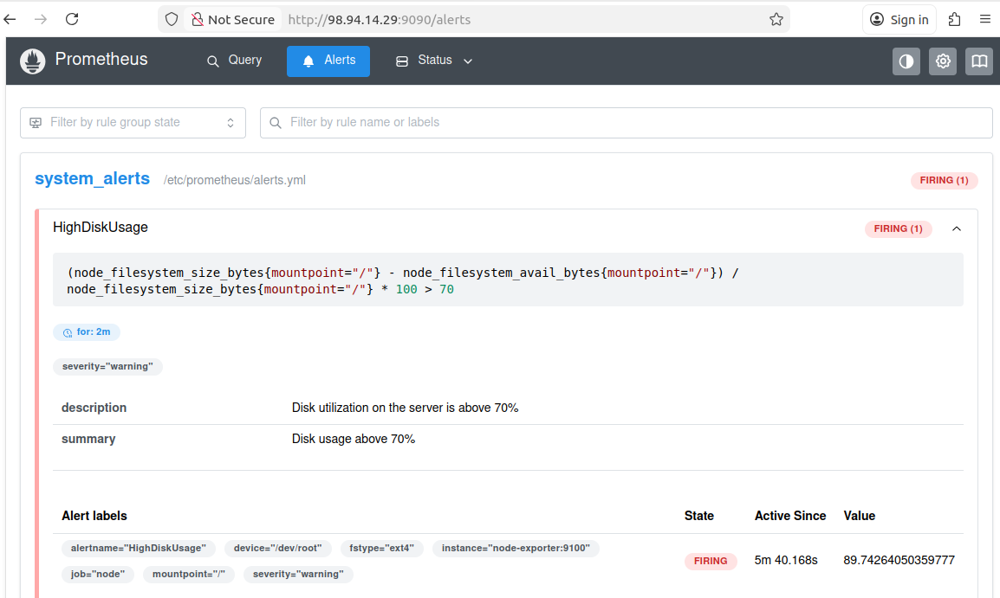
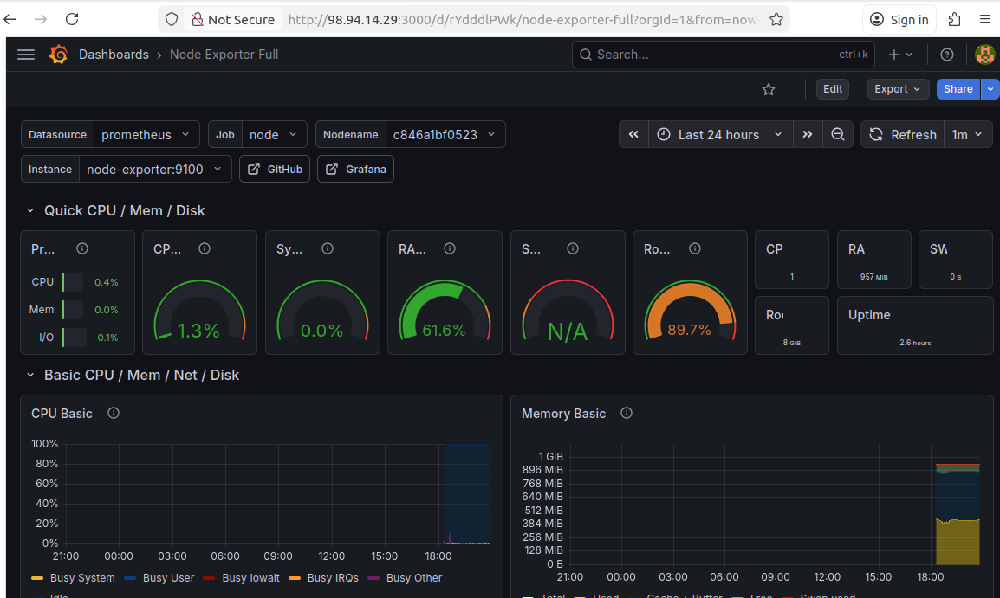
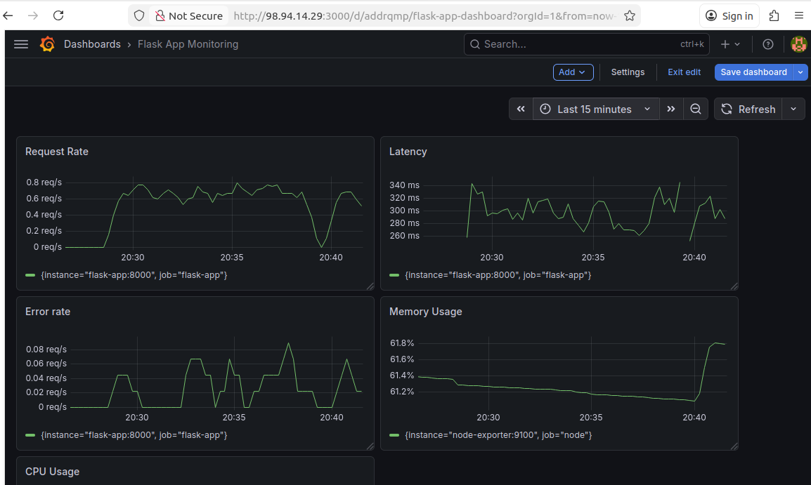
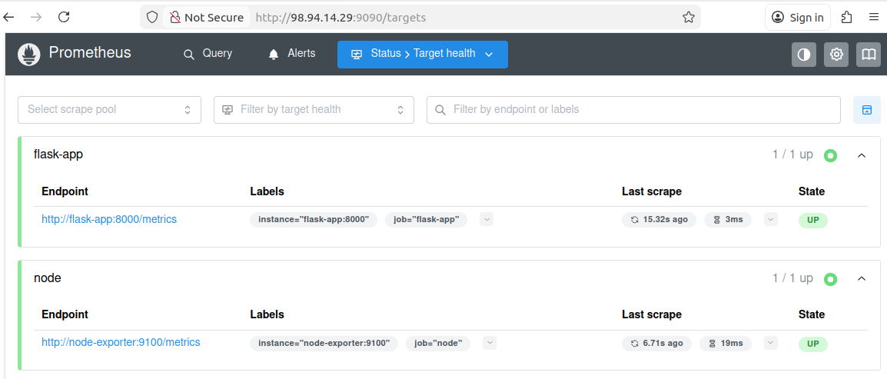

# AWS DevOps Monitoring Pipeline

## Overview
This project implements a **production-style DevOps monitoring pipeline**, designed not only to provision and deploy infrastructure, but also to validate how the system behaves under real-world failure conditions.

The focus was not just on deploying tools, but on ensuring the system is **observable, reliable, and properly tested under stress**.

## Architecture

- Terraform → Infrastructure provisioning (EC2, Security Groups, CloudWatch, SNS)  
- Ansible (Roles-based) → Server configuration and deployment  
- Docker → Containerized services  
- Prometheus → Metrics collection  
- Grafana → Visualization dashboards  
- Alertmanager → Application-level alerting  
- AWS CloudWatch + SNS → Infrastructure-level alerting  
- GitHub Actions → CI/CD pipeline automation  

## Key Features

- Automated infrastructure provisioning using Terraform  
- Role-based configuration management with Ansible  
- Containerized monitoring stack deployment  

- Dual-layer alerting:
  - Infrastructure alerts (CloudWatch + SNS)  
  - Application alerts (Prometheus + Alertmanager)  

- CI/CD pipeline designed for **real-world execution constraints**:
  - Concurrency control to prevent Terraform state conflicts  
  - Timeout handling to avoid hanging executions  
  - Non-interactive Terraform execution for CI environments  

- Secure secret handling via GitHub Actions  

## Security Approach

Security was treated as a first class concern:

- No hardcoded credentials in the repository  
- Secrets managed via GitHub Actions  
- SSH public key injected securely  
- Environment variables used for sensitive runtime configuration  
- Clear separation between infrastructure and application layers  

## Monitoring & Observability

- Node Exporter → System metrics (CPU, Memory, Disk)  
- Flask App Metrics → Application-level insights  
- Prometheus → Scraping and storing metrics  
- Grafana → Real-time dashboards and visualization  
- Alertmanager → Alert routing and notifications  

## Failure Testing & Validation

To simulate real production conditions, the system was tested with:

- Traffic generation to validate metric ingestion  
- Service shutdowns to trigger downtime alerts  
- Disk pressure simulation for threshold-based alerts  
- End-to-end alert validation via email notifications  

This ensured the system was not just deployed, but **observably reliable under failure conditions**.

## CI/CD Pipeline

The GitHub Actions pipeline automates:

1. Terraform initialization and validation  
2. Infrastructure provisioning  
3. Ansible configuration and service setup  
4. Monitoring stack deployment  

### Engineering Considerations

- Concurrency control to protect Terraform state  
- Timeout configuration to prevent stuck pipelines  
- Fully non-interactive execution for CI/CD environments  

## Screenshots

### Prometheus Alert (High Disk Usage)


### Grafana Node Exporter Dashboard


### Flask App Monitoring Dashboard


### Prometheus Target Health


## How to Run

This project follows a two-stage infrastructure setup (**bootstrap → main**) and automated configuration using Ansible and GitHub Actions.

### 1. Clone the Repository

```bash
git clone https://github.com/Ajotony/aws-devops-monitoring-pipeline.git
cd aws-devops-monitoring-pipeline
```

### 2. Generate SSH Key Pair

```bash
ssh-keygen -t rsa -b 4096 -f infra_key
```

This creates:
* infra_key (private key)
* infra_key.pub (public key)

### 3. Configure GitHub Secrets

Add the following secrets in your repository:

* AWS_ACCESS_KEY_ID
* AWS_SECRET_ACCESS_KEY
* AWS_REGION
* SSH_PUBLIC_KEY → contents of infra_key.pub
* EC2_SSH_KEY → contents of infra_key
* SMTP_USERNAME
* SMTP_PASSWORD
* ALERT_EMAIL

### 4. Bootstrap Terraform Backend (Run Locally)

```bash
cd bootstrap
terraform init
terraform apply -auto-approve
```

This creates:

* S3 bucket for Terraform state
* DynamoDB table for state locking

### 5. Verify Backend Configuration

Ensure your main Terraform configuration references:

* The created S3 bucket
* The DynamoDB lock table

### 6. Deploy via GitHub Actions

Trigger the workflow:

* Push to repository
  OR
* Manually run from: GitHub → Actions → Run Workflow

The pipeline will:

1. Initialize Terraform
2. Provision infrastructure
3. Configure server using Ansible
4. Deploy monitoring stack

### 7. Access Deployed Services

Use the EC2 public IP:

* Flask App → http://<EC2-IP>:8000
* Prometheus → http://<EC2-IP>:9090
* Grafana → http://<EC2-IP>:3000
* Alertmanager → http://<EC2-IP>:9093

### 8. Validate Monitoring & Alerts

Generate traffic:

```bash
./scripts/traffic.sh <EC2-IP>
```

Simulate failure:

```bash
ssh -i infra_key ubuntu@<EC2-IP>
docker stop flask-app
```

Expected results:

* Metrics visible in Grafana
* Prometheus target shows DOWN
* Alert appears in Alertmanager
* Email notification received

### 10. Cleanup

```bash
cd terraform
terraform destroy
```


